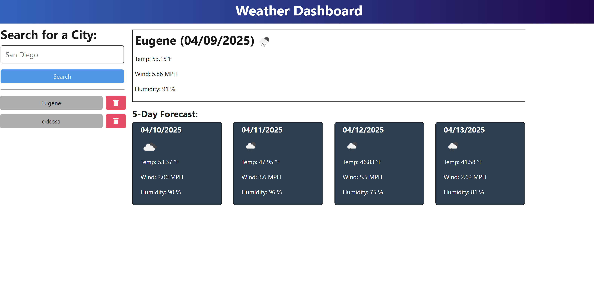

#  Weather Dashboard

A full-stack weather forecast application that allows users to search for cities and view the current and 5-day weather outlook. Powered by the OpenWeather API and built with TypeScript, Express, and a custom frontend.

##  Live App

[View the deployed app on Render](https://weatherdashboard-dg7w.onrender.com)  

---

##  Screenshots

---

##  Features

-  Search any city to view current weather
-  View a 5-day forecast with temperature, wind, humidity, and icons
-  Search history with persistent server-side storage
-  Ability to delete individual cities from search history
-  Friendly UI and formatted weather dates
-  Backend written in **TypeScript**
-  Fully deployed on **Render**

---

##  Technologies Used

### Frontend

- HTML, CSS, TypeScript
- `dayjs` for date formatting

### Backend

- Node.js / Express
- TypeScript
- Axios
- UUID
- dotenv

### APIs

- [OpenWeather Geo API](https://openweathermap.org/api/geocoding-api)
- [OpenWeather 5-Day Forecast API](https://openweathermap.org/forecast5)

---

## Author

- [Chris Munoz](https://github.com/Fadedsetton)